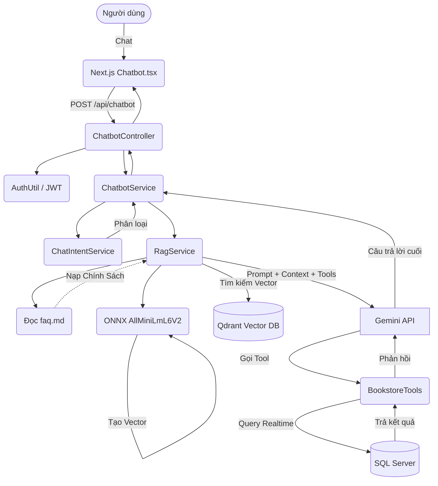

# Tài liệu phân tích Chi tiết Kiến trúc Chatbot AI 

Tài liệu này tổng hợp toàn bộ các giải thích chi tiết về cách Chatbot AI được xây dựng trong dự án (bao gồm Spring Boot, Next.js, Qdrant, Gemini, RAG, Tool Calling). Tài liệu được viết dành riêng cho việc ôn tập và thuyết trình bảo vệ đồ án.

---

## PHẦN 1. Tổng quan chatbot

Chatbot trong dự án này đóng vai trò là một trợ lý ảo của nhà sách, kết hợp giữa RAG (Retrieval-Augmented Generation) để tìm kiếm nội dung, Tool Calling để lấy dữ liệu thời gian thực và FaqLoader để học thuộc chính sách cửa hàng.

**Chatbot có thể làm những gì?**
1. **Tư vấn sách / Tìm sách?** **CÓ**. Dùng Tool `searchBooks` để lấy dữ liệu sách thực tế, và dùng RAG với Qdrant để hiểu ngữ nghĩa nội dung sách.
2. **Trả lời giá sách / tồn kho?** **CÓ**. Gọi Tool `getBookRealtimeInfo` vào SQL Server, báo chính xác giá thật và số lượng tồn kho.
3. **Trạng thái đơn hàng & Tài khoản?** **CÓ**. Khách đăng nhập có thể dùng Tool kiểm tra `getOrderStatus`, `getMyRecentOrders`, hạng thành viên (`getUserProfileInfo`) bảo mật qua JWT.
4. **Thư viện sách nói?** **CÓ**. Tool `getMyAudiobookLibrary` kiểm tra ngay lập tức quyền sở hữu sách nói của khách.
5. **Khuyến mãi & Voucher?** **CÓ**. Dùng Tool lấy danh sách khuyến mãi, voucher đang chạy và check xem voucher có hợp lệ với đơn không (`validateVoucherForUser`).
6. **Chính sách cửa hàng?** **CÓ**. Hệ thống đọc file `faq.md` khi khởi động (thông qua `FaqLoader`) và nạp vào trí nhớ (System Prompt) cho AI.

**📌 Đoạn mô tả ngắn gọn dùng để thuyết trình:**
> "Chatbot của chúng em là một trợ lý ảo xây dựng trên LangChain4j. Nó giải quyết triệt để vấn đề AI bị 'ảo giác' bằng cách phân chia dữ liệu làm 3 luồng: Dữ liệu tĩnh (như Chính sách) nạp qua file FAQ; Dữ liệu ngữ nghĩa sách tìm qua Qdrant Vector Database; và Dữ liệu động (Giá cả, Tồn kho, Đơn hàng cá nhân) được lấy theo thời gian thực từ SQL Server thông qua 10 công cụ (Tool Calling)."

---

## PHẦN 2. Kiến trúc hệ thống

- **Next.js frontend:** Giao diện chat, gửi kèm JWT token.
- **Spring Boot backend:** Điều phối LangChain4j.
- **Gemini Chat Model:** Quyết định trả lời hoặc gọi Tool.
- **Qdrant:** Vector Database lưu đặc trưng sách.
- **SQL Server:** Database lưu thông tin thực tế.
- **FaqLoader:** Đọc file Markdown FAQ nạp vào Prompt.
- **BookstoreTools.java:** Chứa 10 method `@Tool` cho Gemini tự gọi.

**Sơ đồ kiến trúc (Mermaid):**

---

## PHẦN 3. Bí mật tối ưu: Sử dụng Local Embedding Model (ONNX)

Dự án đang sử dụng mô hình chạy Local tên là `AllMiniLmL6V2EmbeddingModel` của thư viện LangChain4j thay vì dùng API của Google.

**Lợi ích khổng lồ:**
- **Tiết kiệm chi phí 100%:** Không tốn tiền gọi API Embedding.
- **Tốc độ cực nhanh (Low Latency):** Vector hóa ngay trên RAM máy chủ (chỉ ~90MB weights).
- **Bảo mật:** Dữ liệu không bị tuồn ra ngoài.

---

## PHẦN 4. Danh sách file cốt lõi của Chatbot

| STT | File | Vai trò chính |
|-----|------|---------------|
| 1 | `ChatbotController.java` | API Endpoints: Nhận request, xử lý userId. |
| 2 | `ChatbotService.java` | "Trái tim" điều phối, xử lý format lại ID sách để UI render. |
| 3 | `RagService.java` | Cấu hình Agent: Ghép nối ChatMemory, Qdrant, Tools, FaqLoader, System Prompt. |
| 4 | `BookstoreTools.java` | Khai báo 10 `@Tool` thao tác trực tiếp với Database. |
| 5 | `ChatbotPrompt.java` | Chứa `SYSTEM_PROMPT` quy định tính cách nghiêm ngặt. |
| 6 | `FaqLoader.java` | Nạp file `faq.md` vào bộ nhớ lúc khởi động. |
| 7 | `BookIndexingService.java`| Đẩy Vector sách lên Qdrant. |
| 8 | `faq.md` | Tài liệu chính sách vận chuyển, đổi trả, hạng thành viên (Dữ liệu tĩnh). |

**Danh sách 10 Tools hiện có trong BookstoreTools:**
1. `getBookRealtimeInfo`: Giá, tồn kho, audio.
2. `searchBooks`: Tìm sách theo từ khóa.
3. `getOrderStatus`: Tra mã đơn.
4. `getMyRecentOrders`: 5 đơn gần nhất.
5. `getActivePromotions`: Khuyến mãi đang chạy.
6. `getActiveVouchers`: Voucher đang có.
7. `validateVoucherForUser`: Check mã voucher.
8. `getUserProfileInfo`: Hạng thành viên, chi tiêu.
9. `getMyAudiobookLibrary`: Sách nói đã sở hữu.
10. `getStoreInformation`: Thông tin liên hệ cửa hàng.

---

## PHẦN 5. Lỗ hổng Placeholder và cách Xóa Sách khỏi Qdrant

Trong file `BookIndexingService.java`, có hàm `removeBookFromIndex`. 
Do Langchain4j bản hiện tại chưa support xóa Vector bằng Metadata filter qua chuẩn chung, hàm này hiện đang in log cảnh báo. Nếu đưa lên production thật, ta cần dùng `QdrantClient` native để xóa payload `bookId`.
