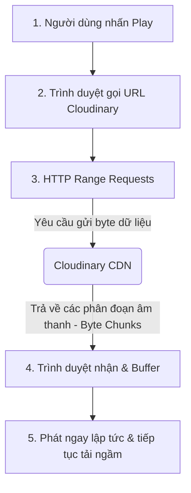
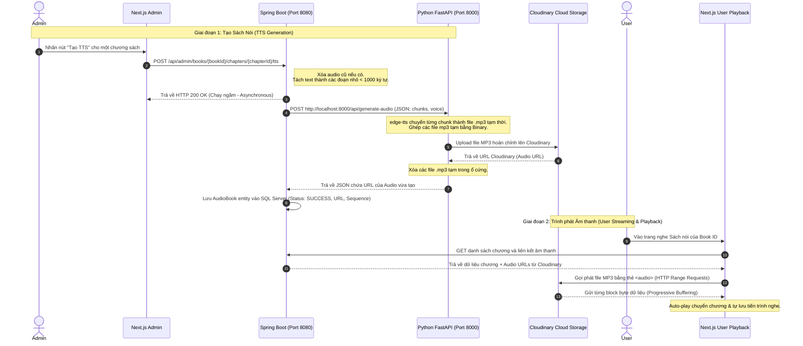

This is a [Next.js](https://nextjs.org) project bootstrapped with [`create-next-app`](https://nextjs.org/docs/app/api-reference/cli/create-next-app).

## Getting Started

First, run the development server:

```bash
npm run dev
# or
yarn dev
# or
pnpm dev
# or
bun dev
```

Open [http://localhost:3000](http://localhost:3000) with your browser to see the result.

You can start editing the page by modifying `app/page.tsx`. The page auto-updates as you edit the file.

This project uses [`next/font`](https://nextjs.org/docs/app/building-your-application/optimizing/fonts) to automatically optimize and load [Geist](https://vercel.com/font), a new font family for Vercel.

## Learn More

To learn more about Next.js, take a look at the following resources:

- [Next.js Documentation](https://nextjs.org/docs) - learn about Next.js features and API.
- [Learn Next.js](https://nextjs.org/learn) - an interactive Next.js tutorial.

You can check out [the Next.js GitHub repository](https://github.com/vercel/next.js) - your feedback and contributions are welcome!

## Deploy on Vercel

The easiest way to deploy your Next.js app is to use the [Vercel Platform](https://vercel.com/new?utm_medium=default-template&filter=next.js&utm_source=create-next-app&utm_campaign=create-next-app-readme) from the creators of Next.js.

Check out our [Next.js deployment documentation](https://nextjs.org/docs/app/building-your-application/deploying) for more details.


### Danh sách thư viện (requirements.txt) & Vai trò trong TTS Microservice

Microservice xử lý Sách nói (Audiobook) sử dụng Python làm ngôn ngữ lõi. Dưới đây là chức năng của từng thư viện cấu thành nên hệ thống:

| Thư viện | Chức năng / Vai trò chính |
| :--- | :--- |
| **`fastapi`** | Framework lõi để xây dựng các API Endpoints hiệu suất cao. Dùng để tạo các cổng tiếp nhận văn bản cần đọc từ Core Backend (Spring Boot). |
| **`uvicorn`** | Máy chủ web (ASGI Server). Làm nhiệm vụ khởi chạy ứng dụng FastAPI và lắng nghe các luồng request đến ở port `8000`. |
| **`edge-tts`** | Thư viện Text-to-Speech cốt lõi. Chịu trách nhiệm gọi engine của Microsoft Edge để chuyển đổi văn bản (Text) thành tệp âm thanh (Audio/MP3). |
| **`cloudinary`** | SDK kết nối với dịch vụ lưu trữ đám mây. Tự động upload tệp âm thanh sau khi tạo xong lên Cloudinary để tối ưu dung lượng server và trả về URL (Audio Link). |
| **`pydantic`** | Lớp bảo mật và kiểm định (Data Validation). Đảm bảo cấu trúc dữ liệu đầu vào (Schema) từ Spring Boot gửi sang đúng định dạng, không bị thiếu sót trước khi đem đi xử lý. |
| **`python-multipart`** | Hỗ trợ FastAPI tiếp nhận và phân giải các request được gửi dưới chuẩn `multipart/form-data` (hữu ích khi cần upload trực tiếp file text/audio). |

###  Luồng Truyền Phát Âm Thanh (Media Streaming Flow) trong Sách Nói

Dự án áp dụng kỹ thuật **HTTP Progressive Streaming** để tối ưu hóa hiệu năng truyền phát âm thanh của Audiobook:

#### 1. Quy trình Truyền Tải (Data Flow)


#### 2. Nguyên lý Hoạt Động Chi Tiết
* **HTTP Range Requests:** Khi phát file MP3 từ URL Cloudinary, thẻ `<audio>` của trình duyệt không tải toàn bộ file về máy. Thay vào đó, nó tự động gửi các yêu cầu có Header `Range: bytes=X-Y`. Cloudinary chỉ gửi lại các đoạn dữ liệu nhỏ tương ứng.
* **Buffering & Streaming (Bộ đệm & Truyền phát):** Trình duyệt chỉ cần tải vài giây đầu tiên vào bộ nhớ đệm (buffer) là có thể phát ngay lập tức (giảm thời gian chờ xuống dưới 0.5s). Phần còn lại sẽ được tải ngầm liên tục khi người dùng đang nghe.
* **Tua Nhạc Linh Hoạt (Seeking):** Khi người dùng tua đến bất kỳ vị trí nào, trình duyệt sẽ hủy luồng tải hiện tại và gửi yêu cầu lấy các bytes dữ liệu bắt đầu từ vị trí mới, tránh lãng phí băng thông tải những đoạn không cần thiết.
* **Tối Ưu Máy Chủ:** Dữ liệu âm thanh truyền trực tiếp từ Cloudinary về Trình duyệt của Client, hoàn toàn không đi qua máy chủ Next.js hay Spring Boot. Điều này giúp giải phóng băng thông cho hệ thống và tránh tình trạng nghẽn mạng khi có nhiều người truy cập cùng lúc.

---

# 🎧 ĐẶC TẢ CHI TIẾT LUỒNG SÁCH NÓI (AUDIOBOOK FLOW) & PHÂN CHIA NHÓM

Tài liệu này trình bày chi tiết về kiến trúc hoạt động của tính năng Sách nói (Audiobook) trong hệ thống và đưa ra kế hoạch phân chia cho các thành viên trong nhóm cùng tìm hiểu và làm chủ công nghệ này.

## Ⅰ. Sơ đồ Tuần tự Hệ thống (End-to-End System Flow)

Dưới đây là sơ đồ tuần tự thể hiện các bước từ khi Admin kích hoạt tạo Audio cho đến khi Người dùng cuối (User) nghe trên thiết bị:



---

## Ⅱ. Kế hoạch Phân chia Nghiên cứu cho Nhóm (4 Thành viên)

Để tất cả các thành viên hiểu sâu và nắm vững từng luồng, chúng ta chia hệ thống thành **4 mảng chuyên biệt**. Mỗi thành viên sẽ nghiên cứu sâu một mảng và chuẩn bị nội dung để thuyết trình/giải thích cho cả nhóm.

### 👤 Thành viên 1: Quản trị Chương & CMS (Admin Book Content & Management)
* **Mục tiêu:** Nắm vững cách quản lý dữ liệu văn bản sách, nạp dữ liệu từ file và quản lý trạng thái TTS ở giao diện Admin.
* **Các file/thư mục chính cần đọc:**
  * Backend Java: `AdminBookChaptersApiController.java` (Các API GET/POST/DELETE/PUT chương sách).
  * Frontend: Các giao diện Admin quản lý sách, chương và kích hoạt dịch thuật.
* **Nội dung cần tìm hiểu:**
  1. Quy trình upload và đọc file văn bản (`MultipartFile textFile`) để lấy nội dung chương sách.
  2. Cách tính toán thời lượng phát ước tính (`wordCount / 2`) và map trạng thái TTS từ Database ra Frontend (`completed`, `processing`, `failed`, `pending`).
* **Câu hỏi tự kiểm tra:** *Khi người dùng sửa nội dung chương sách, tại sao hệ thống lại xóa file audio cũ?*

### 👤 Thành viên 2: Nhạc trưởng Điều phối TTS (Backend TTS Orchestrator)
* **Mục tiêu:** Nắm vững cơ chế xử lý chuỗi ký tự, WebClient bất đồng bộ và cơ chế Reactive Programming của Spring Boot.
* **Các file/thư mục chính cần đọc:**
  * Backend Java: `com.poly.java5.Service.TtsService` và `com.poly.java5.Controller.AudioController`.
* **Nội dung cần tìm hiểu:**
  1. Thuật toán `splitTextSafely`: Tại sao phải cắt văn bản ở vị trí dấu chấm, chấm hỏi hoặc khoảng trắng? Tại sao giới hạn là 1000 ký tự?
  2. Thuật toán `sanitizeText`: Tại sao phải loại bỏ HTML tags, emoji và ký tự điều khiển trước khi gửi đi?
  3. Lớp `WebClient` và cơ chế Reactive (`Mono`, `Flux`, `.subscribe()`): Tại sao Spring Boot trả kết quả về Next.js ngay lập tức nhưng việc tạo Audio vẫn tiếp tục chạy ngầm được?
* **Câu hỏi tự kiểm tra:** *Cơ chế xử lý bất đồng bộ (`subscribe`) giúp gì cho hiệu năng của server khi có nhiều yêu cầu tạo audio cùng lúc?*

### 👤 Thành viên 3: Chuyên gia Microservice & Lưu trữ (Python FastAPI & Cloudinary CDN)
* **Mục tiêu:** Nắm vững dịch vụ Python, cách dùng Microsoft Edge-TTS và cách tối ưu hóa ghép nối âm thanh không cần FFMPEG.
* **Các file/thư mục chính cần đọc:**
  * Thư mục `TTS-Python-Service`: file `main.py`, `requirements.txt`.
* **Nội dung cần tìm hiểu:**
  1. Cách thức hoạt động của FastAPI và cấu trúc định dạng JSON nhận vào (`TTSRequest`).
  2. Thư viện `edge-tts`: Cách gọi API giọng đọc của Microsoft Edge, các tham số cấu hình giọng đọc (`voice`, `pitch`, `rate`).
  3. Cơ chế **Binary Concatenation** (Ghép nối nhị phân): Tại sao có thể ghép các file MP3 bằng cách đọc và ghi byte (`wb`, `rb`) mà không cần cài đặt FFMPEG?
  4. Cơ chế dọn dẹp file tạm trong khối `finally` của Python để tránh đầy ổ cứng server.
* **Câu hỏi tự kiểm tra:** *Tại sao phải đặt host là `0.0.0.0` thay vì `127.0.0.1` when khởi chạy uvicorn trên máy khác?*

### 👤 Thành viên 4: Trình phát & Trải nghiệm Người dùng (Frontend Player & Progressive Streaming)
* **Mục tiêu:** Hiểu sâu về cách thức truyền phát nhạc trên trình duyệt, các sự kiện của thẻ `<audio>` và tối ưu hóa trải nghiệm nghe liên tục.
* **Các file/thư mục chính cần đọc:**
  * Frontend: `d:\Java6\src\app\user\books\[id]\audiobook\page.tsx`.
  * Tài liệu `README.md` (mục Luồng Truyền Phát Âm Thanh).
* **Nội dung cần tìm hiểu:**
  1. Cơ chế **HTTP Range Requests** và Progressive Streaming: Trình duyệt tải nhạc theo kiểu gì? Có tải cả file MP3 50MB cùng một lúc không?
  2. Cách thiết lập trình phát nhạc tự động chuyển chương (Gapless/Autoplay chapter) không bị ngắt quãng khi kết thúc file.
  3. Cơ chế đồng bộ hóa tiến trình nghe của người dùng (lưu lại thời gian đang nghe vào DB qua API để lần sau nghe tiếp).
* **Câu hỏi tự kiểm tra:** *Nếu người dùng tua nhanh qua một đoạn dài, trình duyệt sẽ gửi request gì đến Cloudinary để lấy dữ liệu?*

---

## Ⅲ. Quy trình Hợp tác và Báo cáo Nhóm

Để đảm bảo hiệu quả, nhóm nên tổ chức một buổi chia sẻ ngắn khoảng 45-60 phút theo trình tự sau:

1. **Thành viên 1** trình bày giao diện và API tạo chương sách (Đầu vào văn bản).
2. **Thành viên 2** giải thích cách Backend Spring xử lý văn bản đó và gửi yêu cầu đi.
3. **Thành viên 3** giải thích cách Python tạo ra file âm thanh hoàn chỉnh và lưu lên đám mây.
4. **Thành viên 4** trình bày cách client (trình duyệt) lấy file âm thanh về phát mượt mà cho người dùng.

---

## Ⅳ. Hướng dẫn Chạy Dự án (Local & Mạng LAN)

Hệ thống có thể khởi chạy ở 2 chế độ: **Chạy cục bộ (Local)** trên máy tính cá nhân hoặc **Chạy trong mạng LAN** để kiểm thử trên các thiết bị khác (như điện thoại, máy tính bảng).

### 1. Khởi chạy mặc định (Chế độ Local)
Chế độ này phục vụ phát triển trực tiếp trên máy tính của bạn thông qua địa chỉ `localhost`.

* **Địa chỉ truy cập:**
  * **Frontend (Next.js):** [http://localhost:3000](http://localhost:3000)
  * **Backend (Spring Boot):** [http://localhost:8080](http://localhost:8080)
  * **Python TTS Service:** [http://localhost:8000](http://localhost:8000)
* **Cấu hình file `.env.local`:**
  ```env
  NEXT_PUBLIC_API_URL=http://localhost:8080
  ```
* **Cách chạy:**
  Chỉ cần click đúp vào file `run-dev.bat` ở thư mục gốc của dự án. Hệ thống sẽ tự động khởi động cả 3 cổng dịch vụ.

### 2. Khởi chạy để test trên mạng LAN (Cho thiết bị khác kết nối)
Nếu bạn muốn dùng điện thoại hoặc thiết bị khác trong cùng mạng Wi-Fi truy cập vào dự án:

1. **Tìm địa chỉ IP (IPv4) của máy tính:**
   Mở CMD/PowerShell trên máy tính chạy Backend và gõ lệnh:
   ```bash
   ipconfig
   ```
   *Ví dụ tìm được IP là: `192.168.1.31`*

2. **Cập nhật cấu hình Frontend (`.env.local`):**
   Đổi `localhost` thành IP máy tính của bạn:
   ```env
   NEXT_PUBLIC_API_URL=http://192.168.1.31:8080
   ```

3. **Cập nhật cách khởi chạy cổng Frontend Next.js:**
   Để các thiết bị khác trong LAN truy cập được Next.js, cần chạy với cờ `-H 0.0.0.0`. 
   Bạn có thể sửa dòng số **9** trong file `run-dev.bat` từ:
   ```batch
   start "Frontend Next.js" cmd /k "cd /d d:\Java6 && npm run dev"
   ```
   Thành:
   ```batch
   start "Frontend Next.js" cmd /k "cd /d d:\Java6 && npm run dev -- -H 0.0.0.0"
   ```

4. **Truy cập từ thiết bị di động:**
   Kết nối điện thoại vào cùng Wi-Fi với máy tính, sau đó mở trình duyệt và truy cập:
   ```text
   http://[IP_MAY_TINH]:3000  (Ví dụ: http://192.168.1.31:3000)
   ```

> [!NOTE]
> * Backend Spring Boot đã được thiết lập CORS động với mẫu đầu vào (`allowedOriginPatterns`) cho phép mọi IP trong dải `http://192.168.*:3000` kết nối mà không bị chặn.
> * Hãy đảm bảo tường lửa (Firewall) trên máy tính chạy server không chặn các cổng 3000, 8080 và 8000.
